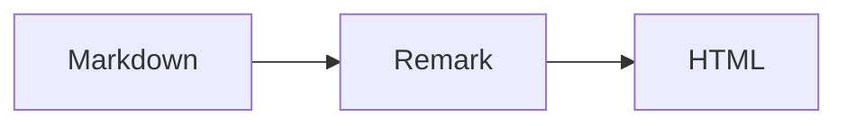
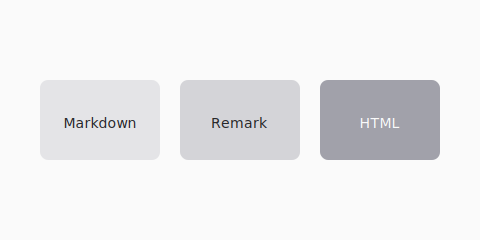

이 포스트는 M2 마크다운 파이프라인의 frontmatter, GFM, 위키링크, 콜아웃, mermaid, 이미지, 헤딩을 한 번에 검증합니다.

## GFM 체크리스트

- [x] remark/rehype 체인
- [ ] M3 UI 연동

| 항목 | 상태 |
| --- | --- |
| Frontmatter | OK |
| Mermaid | OK |

## 위키링크

유효한 링크: [[2026-07-13-pipeline-smoke|파이프라인 샘플]]

깨진 링크: [[missing-post-slug]]

## 콜아웃

> [!note]
> note 콜아웃이 스타일된 블록으로 렌더되어야 합니다.

> [!warning] 주의
> warning 콜아웃도 시각적으로 구분되어야 합니다.

## Mermaid

## 로컬 이미지

## 하위 섹션

### TOC 검증용 헤딩

M3에서 목차 컴포넌트가 이 헤딩을 소비합니다.
